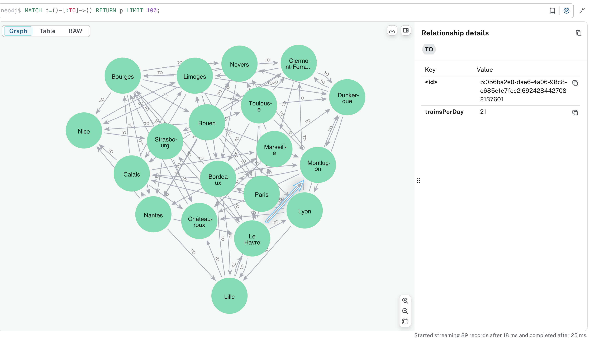
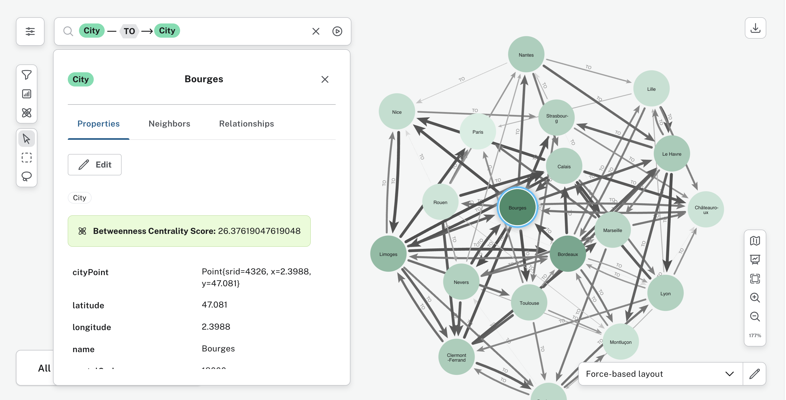
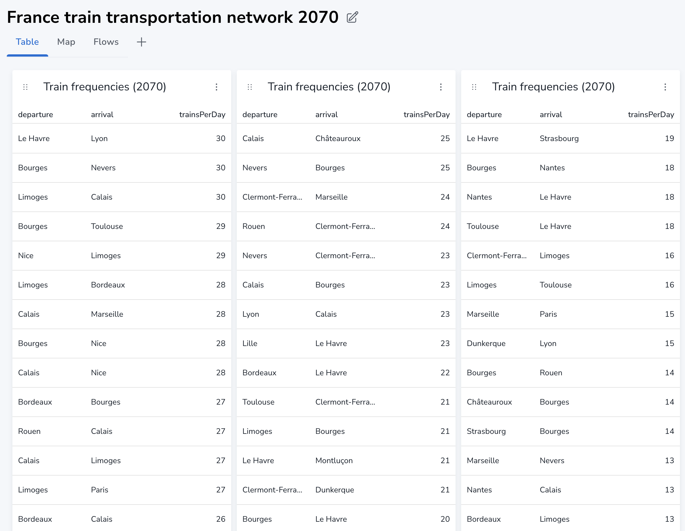

# trains2070
Fictitious French train network in 2070... powered by a Neo4j graph.


##  Introduction
This all started with a discussion with my elderly daughter, who was working on a prospective project in which France would help welcome more climate migrants by 2070, notably by densifying its rail network to bring more people to the depopulated center of the country.

I've asked something like this to ChatGPT(4o model):
```
Can you generate a fictitious CSV dataset for me, indicating the departure city, departure city zip code, departure city latitude, departure city longitude, arrival city, arrival city zip code, arrival city latitude, arrival city longitude and number of trains per day?
This must be a prediction for 2070 of train journeys in France, where central cities and port cities are better served than now.
```

ChatGPT answered:
```
I have generated a fictitious dataset for the French train network in 2070. You can download the CSV file using the link below.
It includes:
- Departure and arrival cities
- Postal codes, latitudes, and longitudes for each city
- Predicted number of trains per day, with enhanced service for central and port cities.
```

## How to create your own 2070 train graph?
### Create a Neo4j instance
You can use:
* [Neo4j Desktop](https://neo4j.com/docs/desktop-manual/current/installation/ "Using Neo4j Enterprise Edition Developer license on your desktop")
* [Neo4j Sandbox](https://neo4j.com/sandbox/ "Experience Neo4j in a click with the Sandbox")
* [Neo4j AuraDB](https://neo4j.com/product/auradb "Fully Managed Graph Database")

### Access Neo4j workspace
* Go to [Neo4j Workspace](https://workspace.neo4j.io)
* Connect to your neo4j instance (fill in URL, user, password)

#### Load data
* Go to `Query` tab
* Import csv file extracted from `cypher` directory
* Play queries one by one
  * 1 - Discover dataset
  * 2 - Create constraint on city name
  * 3 - Create departure cities
  * 4 - Create arrival cities
  * 5 - Create TO relationships bw cities
  * 6 - Refactor geo points for cities
  * 7 - Create point index for city geo point
  * 8 - Create logarithmic property for TO relationship
* Now, explore your data with CYPHER language



#### Explore data
* Go to `Explore` tab
* Type in City-TO->City in the search bar
* Display most critical city thanks to betweenness centrality (need for GDS plugin activated)


### Visualize dashboard in neodash
* Got to [NeoDash](https://neodash.graphapp.io/ "NeoDash - Dashboard Builder for Neo4j")
* Configure Neo4j credentials (fill in URL, user, password)
* Import dashboard from `neodash` directory
* Show the map of most connected cities in 2070

* Show the dataset (top train frequencies between cities in 2070)
